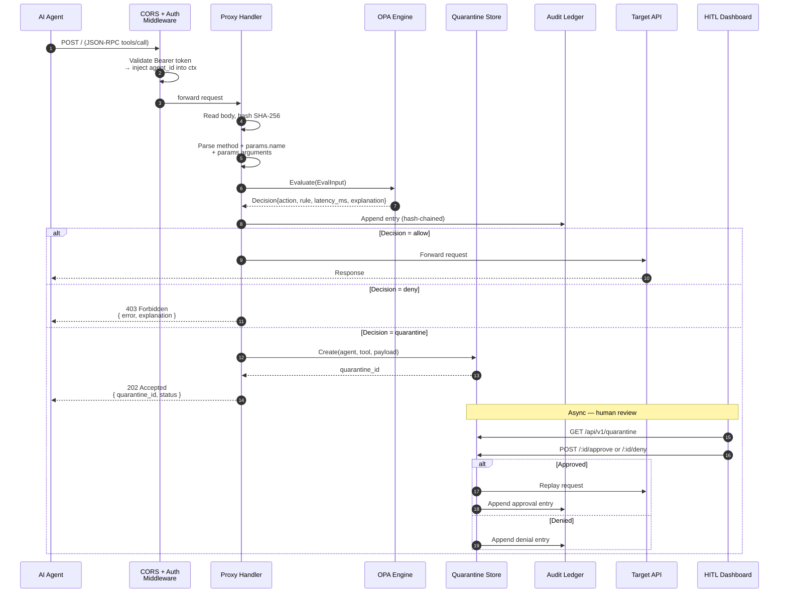
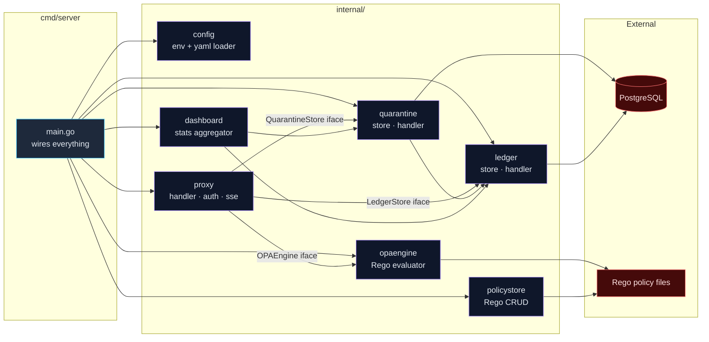

# KiteRail Architecture

This document covers the request lifecycle and the internal package structure of KiteRail.

## Request Lifecycle (Sequence View)

Shows exactly what happens on a single `tools/call` request. This highlights the asynchronous Human-in-the-Loop (HITL) review loop.

## Package Dependency Graph

Shows how the Go packages compose to separate concerns, allowing for easy expansion of backends (e.g., swapping PostgreSQL or OPA).

