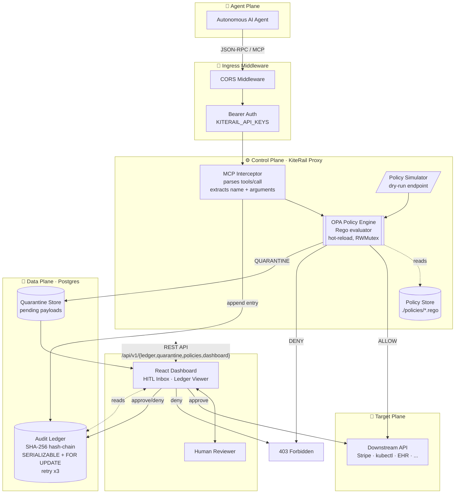
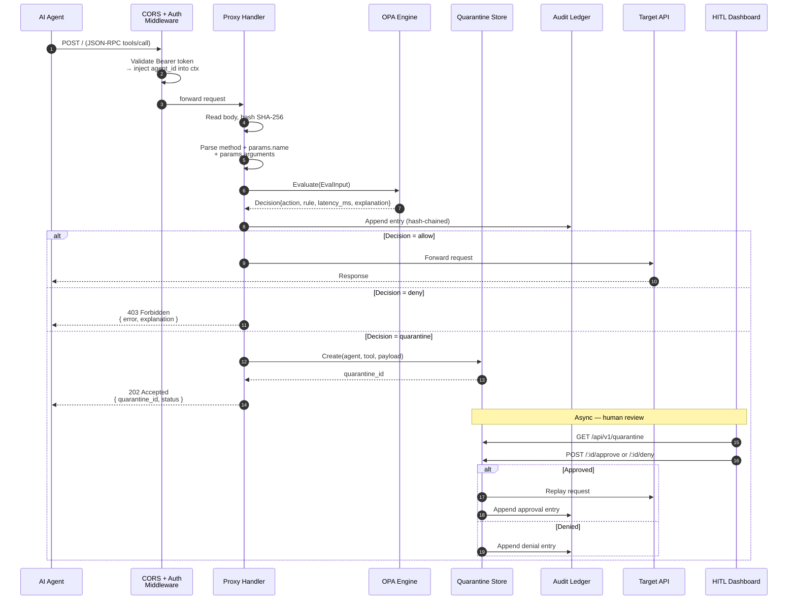
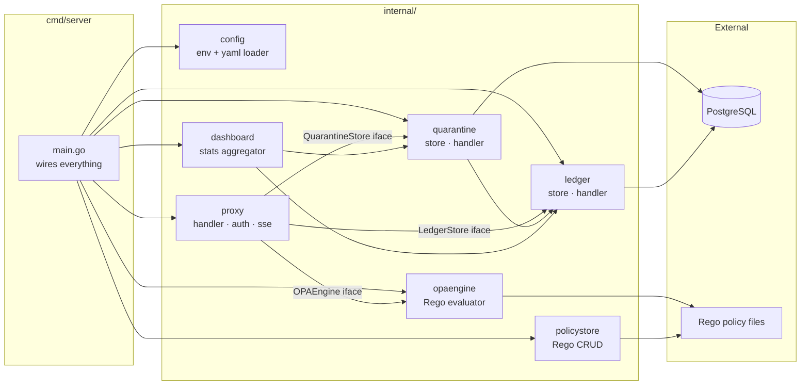

# KiteRail Architecture

> This document explains *why* KiteRail is built the way it is, and where you can extend it without touching the core. If you only have five minutes, read the [Design Thesis](#design-thesis) and skim the three diagrams.

---

## Design Thesis

KiteRail is built on a single opinion:

> **The LLM does one bounded step. Everything safety-critical is deterministic code.**

Most "AI safety" tooling tries to make the model itself safer — prompt hardening, fine-tuning, output classifiers. KiteRail assumes the model is already compromised and asks a different question: *given that the LLM will eventually try something dangerous, what does the surrounding system need to look like so that "dangerous" is a decision you can inspect, diff, and reverse?*

The answer:

| Layer | Behaviour | Why it's here |
|---|---|---|
| **LLM** | Picks a tool and its arguments | Non-deterministic. Not trusted. |
| **Policy** | Rego rules evaluate the tool call | Deterministic. Version-controlled. Reviewable. |
| **Routing** | Allow / deny / quarantine, based on the decision | Deterministic. Testable. |
| **Audit** | Every decision is hash-chained into a tamper-detectable log | Deterministic. Regulator-facing. |
| **Human review** | High-risk calls wait for a person | Deterministic. Auditable. |

Everything below the LLM row can be reasoned about with the same tools we use for any other piece of production software — types, tests, code review, git history. That's the whole point.

---

## System Overview

KiteRail sits inline between an autonomous agent and any downstream API. It groups its responsibilities into six planes.



### Why these six planes?

- **Agent plane** is deliberately outside our trust boundary. We don't ship an SDK. Any agent that speaks JSON-RPC / MCP works today.
- **Ingress middleware** is the only path in. Bearer auth is checked *before* policy evaluation so anonymous traffic never touches the OPA engine.
- **Control plane** is the deterministic core. It's stateless — restart it, no state is lost.
- **Data plane** owns durability. Postgres is the single source of truth for both the audit ledger and the quarantine queue.
- **Human plane** exists because the EU AI Act, SOX, and HIPAA all require it for high-risk decisions. The dashboard is a thin client over the same REST API a third-party UI could hit.
- **Target plane** is untouched. KiteRail never modifies the downstream API, it just decides whether the request reaches it.

---

## Request Lifecycle

What happens on a single tool call, end to end:



Every arrow in this diagram maps to a function call in [`internal/proxy/proxy.go`](../backend/internal/proxy/proxy.go) (the inline proxy path) or [`internal/quarantine/handler.go`](../backend/internal/quarantine/handler.go) (the HITL approval and replay path). If you understand this diagram, you understand the hot path.

### A note on ordering

The audit ledger is written **before** the routing decision is executed (step 8, before the `alt` block). This is intentional: if the proxy crashes between "decide" and "route," the auditor still knows what would have happened. A compliance product where the audit log can lag the action is not a compliance product.

---

## Package Layout



### Design rules the layout enforces

- **`main.go` is the only place that wires implementations to interfaces.** Every other package depends only on interfaces defined next to the consumer (e.g. `proxy.OPAEngine`, `proxy.LedgerStore`).
- **No package imports upward.** `internal/proxy` doesn't know `internal/dashboard` exists.
- **No cycles.** Enforceable via `go vet` and future CI.
- **Handlers and stores are split** in every package that has both. `store.go` is pure data access; `handler.go` is HTTP. Testing either in isolation is trivial.

---

## Concurrency & Correctness

The proxy is inline on the critical path of an agent making a real API call. It has to be fast *and* correct under load. Three problems get explicit treatment.

### 1. Hash-chained ledger under concurrent writes

Every ledger entry stores `hash = SHA256(prev_hash || entry_data)`. Two concurrent writers reading the same `prev_hash` would fork the chain silently. The fix:

- Each `Append()` opens a `SERIALIZABLE` transaction and takes `SELECT ... FOR UPDATE` on the tip of the chain.
- On serialization failure (Postgres error code `40001`), retry up to 3 times with 5–10 ms linear backoff.
- If all retries fail, the error is surfaced — never silently discarded.

This is documented in the [v1.0 CHANGELOG](../CHANGELOG.md#100---2026-08-01) because the previous version had a silent bug here. It's the kind of correctness issue only visible under real concurrent load; catching it in v0.2 → v1.0 was the last thing standing between "prototype" and "shippable."

### 2. OPA engine hot-reload race

`Evaluate()` and `Reload()` both touch the compiled Rego module set. A `sync.RWMutex` guards them: readers (evaluators) don't block each other, but a reload (writer) waits for in-flight evaluations to finish before swapping the module set atomically.

### 3. Graceful shutdown

`main.go` installs a signal handler on `SIGINT` / `SIGTERM`. On shutdown, the HTTP server stops accepting new connections and waits up to 10 seconds for in-flight requests to complete before closing the Postgres connection pool. No half-written ledger entries.

### 4. Conflict-safe quarantine resolution

`Approve()` and `Deny()` both use `WHERE status = 'pending'` and check `RowsAffected`. If two reviewers hit approve simultaneously, exactly one succeeds; the other receives `409 Conflict`. The winning caller's approval is then replayed to the target. This prevents double-spend and double-replay of the same payload.

---

## Extension Points

The interface boundaries in the [package diagram](#package-layout) are the extension points. They exist so that scaling KiteRail into new verticals or new deployment shapes doesn't require rewriting the proxy.

### Add a new decision engine (e.g. Cedar, custom Go logic)

Implement the `proxy.OPAEngine` interface:

```go
type OPAEngine interface {
    Evaluate(ctx context.Context, input EvalInput) (ProxyDecision, error)
}
```

Wire it in `main.go`. The rest of the system is untouched.

### Add a new storage backend (e.g. CockroachDB, Cloud Spanner)

Implement `proxy.LedgerStore` and `proxy.QuarantineStore`:

```go
type LedgerStore interface {
    Append(ctx context.Context, entry ledger.LedgerEntry) error
}
type QuarantineStore interface {
    Create(ctx context.Context, agentID, toolName string, payload []byte) (string, error)
}
```

The hash-chain invariant lives in the store implementation, not the proxy, so a new backend has to honour it — but it can use whatever concurrency primitives the target database offers.

### Add a new event sink (e.g. NATS, Kafka, SIEM webhook)

Implement `proxy.EventPublisher`. v1.0 ships with a `NoOpPublisher` (audit events go straight to the Postgres ledger). v1.1 will re-introduce a `NatsPublisher` for real-time streaming; a `KafkaPublisher` or a `WebhookPublisher` would be a drop-in swap.

### Add a new vertical (DevOps, healthcare, HR)

No code changes. Write Rego. Example: quarantine any `kubectl` operation on a `production` namespace, or block any EHR read where the accessing agent lacks a BAA claim on their token. Policies live in `./policies/<vertical>/*.rego` and are hot-reloaded.

---

## What's Deliberately Excluded from v1.0

Being explicit about scope is how you stay shippable.

| Feature | Why deferred | Target |
|---|---|---|
| NATS JetStream real-time streaming | Adds a runtime dependency for local dev. Postgres-only path is simpler for first-time evaluators. | v1.1 |
| PII/PCI payload redaction | Non-trivial to get right per-vertical. Sketching a per-field Rego-driven redaction model. | v1.2 |
| SSO / SAML / SCIM on the dashboard | Only relevant once a design partner has multiple reviewers. | Cloud tier |
| OpenTelemetry traces | `zap` structured logs cover local debugging. OTel matters when someone runs this in a real cluster. | v1.1 |
| Policy versioning + rollback | Ledger records the policy *rule* today, but not the *policy file hash*. Needed before compliance-officer sign-off. | v1.1 |
| Multi-tenant proxy fleet | Single-tenant self-host is enough for the beachhead. Multi-tenant is a Cloud-tier problem. | Cloud tier |

If you're a potential design partner and one of these is a blocker for your pilot, open a GitHub Discussion — it'll move the roadmap.

---

## Roadmap

Roadmap is split by audience: engineers running the proxy, and engineers extending or adopting it. Both ship as part of v1.1.

### v1.1 · Runtime (correctness, observability, streaming)

1. **Structured request-ID / trace-ID** threaded through proxy → OPA → ledger,
   surfaced in every log line for end-to-end forensics.
2. **`/metrics` endpoint** (Prometheus) — evaluation latency histograms, decision
   counts by action, ledger append duration, quarantine queue depth.
3. **OpenTelemetry traces** — spans for the auth → parse → evaluate → route
   pipeline. Turns "typical p95 <10 ms" from a claim into a live dashboard.
4. **Benchmarks** (`bench/` directory) with reproducible `go test -bench`
   numbers, published in the README to replace the local-only latency claim.
5. **Policy file hash in every ledger entry** — closes the "which policy
   version actually decided this?" gap that a compliance officer will ask about
   on the first call.
6. **NATS JetStream re-integration** — real-time event streaming to external
   SIEMs (Splunk, Datadog, Elastic) via the existing `EventPublisher` interface.

### v1.1 · Developer experience (open-core adoption)

7. **`kiterail` CLI** (`cmd/kiterail/`) — thin wrapper over the REST API:
   `kiterail quarantine list/approve/deny`, `kiterail ledger tail/verify`,
   `kiterail policy test/simulate`. First-class terminal UX, no dashboard needed.
8. **Policy cookbook** (`policies/examples/`) — 6 archetypal patterns
   (allow-list, deny-list, threshold, time-window, agent-scope, jurisdiction,
   regex-arg) with heavy inline comments. Lowers the Rego learning curve.
9. **Embedded SQLite backend** — a `LedgerStore` / `QuarantineStore`
   implementation for zero-infra local dev and single-node deployments.
   `kiterail server --sqlite ./kiterail.db` and you're running.
10. **Docker Compose ergonomics** — bundled `echo-target` service so ALLOW
    requests work out of the box, and NATS removed until v1.1 introduces it
    as an optional profile.
11. **REST API reference** (`docs/API.md`) — curl examples for every endpoint,
    published as a single page so a dev can integrate KiteRail into their
    Makefile without opening the source.

### v1.2 · Compliance & vertical depth

12. **PII / PCI payload redaction** — per-field Rego-driven redaction before
    the ledger write, with SSN, PAN, and IBAN patterns shipped by default.
13. **Policy versioning + rollback** — every policy change is a signed commit
    in the ledger, and any past decision can be replayed against any past
    policy set for regulator-facing forensics.
14. **Second beachhead vertical** — depending on design-partner traction,
    ship a reference policy set for either agent-driven DevOps
    (`kubectl`, `terraform`) or healthcare (HIPAA-scoped EHR access).

### v1.2 · Product bets (positioning for design partners)

These are the strategic capabilities that move KiteRail from "compliance
plumbing" to "the layer regulated AI-agent deployments actually depend on."
See the [README roadmap](../README.md#roadmap) for the design-partner-facing
framing.

15. **Protocol agnosticism** — the MCP-specific parser in
    `internal/proxy/proxy.go` becomes one of several `TrafficDecoder`
    implementations. Adds first-class REST (JSON body + path templates) and
    gRPC (unary + streaming) decoders behind a shared `EvalInput` shape, so
    the same Rego policies govern any protocol.

16. **Compliance packs** — curated, versioned Rego bundles under
    `policies/packs/{pci-dss,hipaa,sox,eu-ai-act}/` maintained alongside the
    codebase. Distinct from the [Policy cookbook](#) (item #8) which teaches
    Rego patterns; packs are ready-to-drop-in policy sets for specific
    regulatory regimes.

17. **Two-identity authorization** — extend `EvalInput` with a `Principal`
    field carrying the human user on whose behalf the agent is acting
    (OAuth token, SAML assertion, or signed principal claim). Policies can
    then check both `input.agent` and `input.principal`, enabling
    agent-level segregation of duties. Blocks the class of attack where a
    compromised or over-scoped agent executes actions its invoking human
    could not.

### On sustainability

KiteRail is and will remain Apache 2.0. If there's demand, we may eventually
offer a hosted, managed version for teams that don't want to run the proxy
themselves — same code, same policies, someone else's Postgres. That decision
is downstream of whether real teams actually adopt this. For now, the entire
focus is making the open-source project excellent.

---

## A Note on the Name

KiteRail is a *kite line* for autonomous agents — enough tension to keep them safe, enough slack to let them fly. The proxy is the rail; policies are the tether; the audit ledger is what the ground crew reads after the flight.

---

*Questions or feedback on this design? Open a [GitHub Discussion](https://github.com/austinchima/KiteRail/discussions) — architectural critique is especially welcome.*
