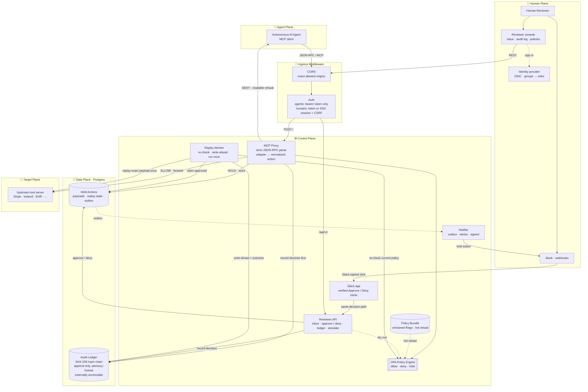
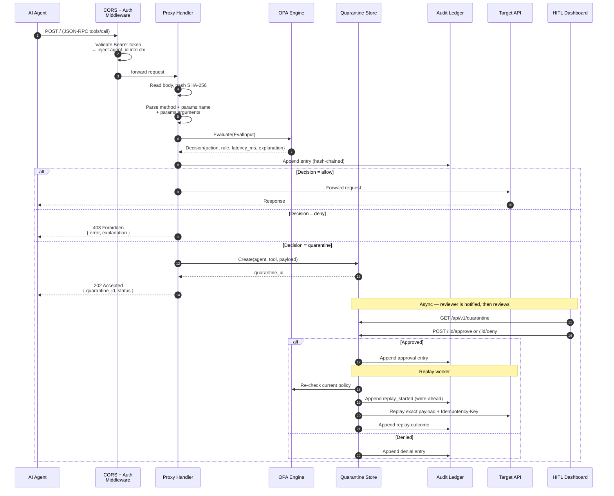
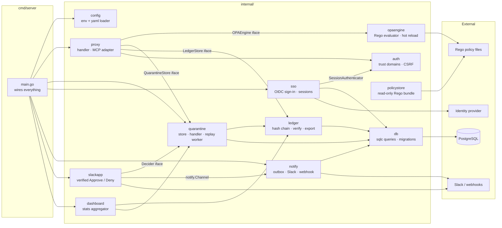

# Elodea Architecture

> This document explains *why* Elodea is built the way it is, and where you can extend it without touching the core. If you only have five minutes, read the [Design Thesis](#design-thesis) and skim the three diagrams.

---

## Design Thesis

Elodea is built on a single opinion:

> **The LLM does one bounded step. Everything safety-critical is deterministic code.**

Most "AI safety" tooling tries to make the model itself safer — prompt hardening, fine-tuning, output classifiers. Elodea assumes the model is already compromised and asks a different question: *given that the LLM will eventually try something dangerous, what does the surrounding system need to look like so that "dangerous" is a decision you can inspect, diff, and reverse?*

The answer:

| Layer | Behaviour | Why it's here |
|---|---|---|
| **LLM** | Picks a tool and its arguments | Non-deterministic. Not trusted. |
| **Policy** | Rego rules evaluate the tool call | Deterministic. Version-controlled. Reviewable. |
| **Routing** | Allow / deny / quarantine, based on the decision | Deterministic. Testable. |
| **Audit** | Every decision is hash-chained into a tamper-detectable log | Deterministic. Regulator-facing. |
| **Human review** | High-risk calls wait for a person | Deterministic. Auditable. |

Everything below the LLM row can be reasoned about with the same tools we use for any other piece of production software — types, tests, code review, git history. That's the whole point.

---

## System Overview

Elodea sits inline between an autonomous agent and any downstream API. It groups its responsibilities into six planes.


```mermaid
flowchart TB
    subgraph Client["🤖 Agent Plane"]
        A[Autonomous AI Agent<br/>MCP client]
    end

    subgraph Ingress["🔐 Ingress Middleware"]
        direction LR
        M1[CORS<br/>exact allowed origins] --> M2[Auth<br/>agents: bearer token only<br/>humans: token or SSO session + CSRF]
    end

    subgraph Control["⚙️ Control Plane"]
        direction TB
        P[MCP Proxy<br/>strict JSON-RPC parse<br/>adapter → normalized action]
        E[[OPA Policy Engine<br/>allow · deny · hold]]
        PS[(Policy Bundle<br/>versioned Rego · hot reload)]
        API[Reviewer API<br/>inbox · approve / deny · ledger · simulate]
        SA[Slack app<br/>verified Approve / Deny clicks]
        W[Replay Worker<br/>re-check · write-ahead · run once]
        N[Notifier<br/>outbox · retries · signed]
        P --> E
        PS -. hot reload .-> E
        API -. dry run .-> E
        W -- re-check current policy --> E
        SA -- same decision path --> API
    end

    subgraph Data["📒 Data Plane · Postgres"]
        direction LR
        L[(Audit Ledger<br/>SHA-256 hash chain<br/>append-only, advisory-locked<br/>externally anchorable)]
        Q[(Held Actions<br/>payloads · replay state · outbox)]
    end

    subgraph Human["👤 Human Plane"]
        direction TB
        UI[Reviewer console<br/>inbox · audit log · policies]
        IDP[Identity provider<br/>OIDC · groups → roles]
        SL[Slack · webhooks]
        REV[Human Reviewer]
        REV --> UI
        REV --> SL
        UI -. sign in .-> IDP
    end

    subgraph Upstream["🎯 Target Plane"]
        T[Upstream tool server<br/>Stripe · kubectl · EHR · ...]
    end

    A -- JSON-RPC / MCP --> M1
    M2 -- POST / --> P
    M2 -- /api/v1 --> API
    UI -- REST --> M1
    SL -- Slack-signed click --> SA

    P -- record decision first --> L
    P -- ALLOW · forward --> T
    P -- DENY · readable refusal --> A
    P -- HOLD · store --> Q

    API -- approve / deny --> Q
    API -- record decision --> L
    W -- claim approved --> Q
    W -- write-ahead + outcome --> L
    W -- replay exact payload once --> T
    Q -. outbox .-> N
    N -- held action --> SL
```

An interactive version, with every box linked to its source file, is in [diagrams/architecture-interactive.html](diagrams/architecture-interactive.html).

### Why these six planes?

- **Agent plane** is deliberately outside our trust boundary. We don't ship an SDK. Any agent that speaks JSON-RPC / MCP works today.
- **Ingress middleware** is the only path in. Authentication is checked *before* policy evaluation so anonymous traffic never touches the OPA engine. Agents authenticate with bearer tokens only; reviewers and admins use a bearer token or an SSO session cookie. The ingress speaks the 2026-07-28 MCP stateless profile: the body is one duplicate-free JSON-RPC 2.0 object and always the source of truth for policy; singleton `Mcp-Method` / `Mcp-Name` mirrored headers are validated against the method and the appropriate parameter (`name` or `uri`) when present, with Base64 MCP names decoded before comparison (contradiction → HTTP 400 + `-32020` *before* OPA), then mirrored — never rewritten — on the way out.
- **`MCP-Protocol-Version` is accepted and forwarded, not enforced.** The 2026-07-28 spec requires the header on every Streamable HTTP POST, but pinning a version is an ops commitment: API7 and LiteLLM both show the ecosystem cost of pinning before upstream servers settle. Elodea records nothing version-dependent in the ledger, so forwarding verbatim carries no integrity risk; its presence selects MCP-native outcomes. Version pinning and negotiation will be revisited once the field's version distribution is measurable.
- **Control plane** is the deterministic core. It's stateless — restart it, no state is lost.
- **Data plane** owns durability. Postgres is the single source of truth for both the audit ledger and the quarantine queue.
- **Human plane** exists because the EU AI Act, SOX, and HIPAA all require it for high-risk decisions. Reviewers hear about held actions from the notifier, and the console is a thin client over the same REST API a third-party UI could hit.
- **Target plane** is untouched. Elodea never modifies the downstream API, it just decides whether the request reaches it.

---

## Request Lifecycle

What happens on a single tool call, end to end:


```mermaid
sequenceDiagram
    autonumber
    participant A as AI Agent
    participant M as CORS + Auth<br/>Middleware
    participant P as Proxy Handler
    participant O as OPA Engine
    participant Q as Quarantine Store
    participant L as Audit Ledger
    participant T as Target API
    participant U as HITL Dashboard

    A->>M: POST / (JSON-RPC tools/call)
    M->>M: Validate Bearer token<br/>→ inject agent_id into ctx
    M->>P: forward request
    P->>P: Read body, hash SHA-256
    P->>P: Parse method + params.name<br/>+ params.arguments
    P->>O: Evaluate(EvalInput)
    O-->>P: Decision{action, rule, latency_ms, explanation}
    P->>L: Append entry (hash-chained)

    alt Decision = allow
        P->>T: Forward request
        T-->>A: Response
    else Decision = deny
        P-->>A: 403 Forbidden<br/>{ error, explanation }
    else Decision = quarantine
        P->>Q: Create(agent, tool, payload)
        Q-->>P: quarantine_id
        P-->>A: 202 Accepted<br/>{ quarantine_id, status }

        Note over U,Q: Async — reviewer is notified, then reviews
        U->>Q: GET /api/v1/quarantine
        U->>Q: POST /:id/approve or /:id/deny
        alt Approved
            Q->>L: Append approval entry
            Note over Q,T: Replay worker
            Q->>O: Re-check current policy
            Q->>L: Append replay_started (write-ahead)
            Q->>T: Replay exact payload + Idempotency-Key
            Q->>L: Append replay outcome
        else Denied
            Q->>L: Append denial entry
        end
    end
```

Every arrow in this diagram maps to a function call in [`internal/proxy/proxy.go`](../backend/internal/proxy/proxy.go) (the inline proxy path), [`internal/quarantine/handler.go`](../backend/internal/quarantine/handler.go) (approval and denial), or [`internal/quarantine/worker.go`](../backend/internal/quarantine/worker.go) (the replay worker). If you understand this diagram, you understand the hot path.

### A note on ordering

The audit ledger is written **before** the routing decision is executed (step 8, before the `alt` block). This is intentional: if the proxy crashes between "decide" and "route," the auditor still knows what would have happened. A compliance product where the audit log can lag the action is not a compliance product. The guarantee is bidirectional — if the ledger write *fails*, the request is refused with `503` and never reaches the target. Allowed requests never execute unaudited.

---

## Package Layout


```mermaid
flowchart LR
    subgraph cmd["cmd/server"]
        MAIN[main.go<br/>wires everything]
    end

    subgraph internal["internal/"]
        CFG[config<br/>env + yaml loader]
        AUTH[auth<br/>trust domains · CSRF]
        SSO[sso<br/>OIDC sign-in · sessions]
        PROXY[proxy<br/>handler · MCP adapter]
        OPA[opaengine<br/>Rego evaluator · hot reload]
        PS[policystore<br/>read-only Rego bundle]
        Q[quarantine<br/>store · handler · replay worker]
        LED[ledger<br/>hash chain · verify · export]
        NOT[notify<br/>outbox · Slack · webhook]
        SLK[slackapp<br/>verified Approve / Deny]
        DASH[dashboard<br/>stats aggregator]
        DB[db<br/>sqlc queries · migrations]
    end

    subgraph external["External"]
        PG[(PostgreSQL)]
        REGO[Rego policy files]
        IDP[Identity provider]
        HOOK[Slack / webhooks]
    end

    MAIN --> CFG
    MAIN --> PROXY
    MAIN --> Q
    MAIN --> SSO
    MAIN --> NOT
    MAIN --> SLK
    MAIN --> DASH

    PROXY -->|OPAEngine iface| OPA
    PROXY -->|QuarantineStore iface| Q
    PROXY -->|LedgerStore iface| LED
    PROXY --> AUTH
    SSO -->|SessionAuthenticator| AUTH

    Q --> LED
    DASH --> LED
    DASH --> Q
    NOT --> DB
    SSO --> DB
    Q --> DB
    LED --> DB

    OPA --> REGO
    PS --> REGO
    DB --> PG
    SSO --> IDP
    NOT --> HOOK
    SLK -->|Decider iface| Q
    SLK -->|notify.Channel| NOT
    SLK --> HOOK
```

### Design rules the layout enforces

- **`main.go` is the only place that wires implementations to interfaces.** Every other package depends only on interfaces defined next to the consumer (e.g. `proxy.OPAEngine`, `proxy.LedgerStore`).
- **No package imports upward.** `internal/proxy` doesn't know `internal/dashboard` exists.
- **No cycles.** Enforceable via `go vet` and future CI.
- **Handlers and stores are split** in every package that has both. `store.go` is pure data access; `handler.go` is HTTP. Testing either in isolation is trivial.

---

## Concurrency & Correctness

The proxy is inline on the critical path of an agent making a real API call. It has to be fast *and* correct under load. Three problems get explicit treatment.

### 1. Hash-chained ledger under concurrent writes

Every ledger entry stores `hash = SHA256(prev_hash || entry_data)`. Two concurrent writers reading the same `prev_hash` would fork the chain silently. The fix:

- Each `Append()` opens a transaction and takes a transaction-scoped advisory lock (`pg_advisory_xact_lock`) before reading the chain tip, so concurrent appends across every replica queue rather than abort. The lock is released at commit, after which the next waiter's READ COMMITTED snapshot sees the new tip.
- A bounded, cancellable retry on SQLSTATE `40001` remains as a fallback.
- Triggers make the table append-only (`UPDATE`/`DELETE`/`TRUNCATE` rejected unless an operator opts in per transaction), and each entry is bound to the policy bundle version that produced it.
- If all retries fail, the error is surfaced — never silently discarded.

This is documented in the [v1.0 CHANGELOG](../CHANGELOG.md#100---2026-08-01) because the previous version had a silent bug here. It's the kind of correctness issue only visible under real concurrent load; catching it in v0.2 → v1.0 was the last thing standing between "prototype" and "shippable."

### 2. OPA engine hot reload

`Reload()` compiles the new bundle *outside* the lock, then swaps the prepared query, readiness, and bundle fingerprint atomically under a `sync.RWMutex`. Evaluations in flight finish on the old query; new ones see the new one. A bundle that fails to compile is rejected and the previous query keeps serving. Reloads come from `SIGHUP`, `POST /api/v1/policies/reload` (admin), or polling the bundle fingerprint (`policy_reload_interval`).

### 3. Graceful shutdown

`main.go` installs a signal handler on `SIGINT` / `SIGTERM`. On shutdown it flips readiness first, cancels the replay worker, keeps a bounded drain delay (default 5 seconds) during which protected routes refuse new work, then waits up to 10 seconds for in-flight requests to complete before closing the Postgres connection pool. No half-written ledger entries.

### 4. Conflict-safe quarantine resolution

`Approve()` and `Deny()` both use `WHERE status IN ('pending', 'replay_failed')` and check `RowsAffected`. If two reviewers hit approve simultaneously, exactly one succeeds; the other receives `409 Conflict`. This prevents double-spend and double-resolution of the same payload.

### 5. Durable, idempotent replay

Replay is owned by a background worker with all state in Postgres:

```
pending → approved → replaying → replayed
                   |            └→ replay_failed → approved (re-approve)
pending → denied
```

Claims are atomic (`UPDATE ... FROM (SELECT ... FOR UPDATE SKIP LOCKED)`), and each recovery-and-replay pass holds a transaction-scoped Postgres advisory lock. This deliberately serializes active worker passes across replicas: recovery can never reset a live worker's claim, while `SKIP LOCKED` remains a database-level defense-in-depth guard. Every replay carries `Idempotency-Key: kiterail-quarantine-<id>`, stable across retries *and* crash recoveries. A redirect is treated as a failed replay and is not followed. The next locked pass returns entries abandoned in `replaying` by a crashed worker to `approved`.

### 6. Separated trust domains

Agents, reviewers, and admins hold distinct token sets (`api_keys`, `reviewer_api_keys`, `admin_api_keys`). Agents can only reach the proxy; approve/deny, ledger reads, and the dashboard require a reviewer or admin identity — which is also the only source of `resolved_by` on HITL decisions (body-supplied identities are ignored). Duplicate tokens across domains are rejected at startup.

**From Slack**, a click on an Approve or Deny button is trusted only after three checks: Slack's request signature (HMAC over timestamp and body, five-minute window) from the configured workspace, the clicker's Slack email being on the configured reviewer list, and the same conflict-safe decision path the console uses. The ledger records the reviewer's email either way.

With single sign-on, reviewers and admins sign in through the organization's OIDC identity provider instead. The server runs the Authorization Code flow with PKCE, maps IdP groups to roles, and gives the browser only an opaque `HttpOnly` cookie; the database stores a SHA-256 of the session token, never the token. Cookie-authenticated changes require a custom header (`X-Requested-With: elodea`) and an allowed `Origin`, which a cross-site form cannot forge. Agent routes never accept cookies.

### 7. Notifications that are neither lost nor duplicated

Held actions are announced through a Postgres outbox (`notification_outbox`, one row per held action and channel). Each worker tick queues pending actions, claims due rows with `FOR UPDATE SKIP LOCKED` under a short lease, and sends them. A failed send backs off (15 s doubling to 1 h, 8 attempts); a crash mid-send is retried when the lease expires. Delivery is therefore at-least-once with a stable delivery ID, never concurrent across replicas, and an action reviewed before its turn is closed without a message.

---

## Designed to Evolve

Elodea governs *actions*, not a particular protocol. The design keeps everything that changes quickly at the edge and everything that must be trustworthy in a small, stable core:

| Layer | Changes when… | Contract |
|---|---|---|
| Ingress adapter (`proxy.Adapter`) | a protocol or protocol revision appears | `Parse` → normalized `Invocation`; render deny/quarantine natively |
| Policy input | almost never | `elodea.eval/v1`, additive-only; `protocol` / `protocol_version` let policies target revisions explicitly |
| Policy bundle | your rules change | Rego, hot-reloaded, fingerprinted (`policy_version`) on every decision |
| Ledger, quarantine, replay | never for protocol reasons | protocol-neutral; replay re-derives the decision through the same adapter + engine |

Consequences:

1. **A new agent protocol is an adapter**, not a fork. It must be strict: anything it cannot fully describe to policy is rejected, because an unparsed request must never be forwarded. One adapter serves one route, so there is no protocol sniffing an attacker could steer.
2. **Policies outlive protocol versions.** Existing fields never change meaning; a rule written against `tool` and `arguments` keeps working when MCP adds a revision.
3. **Approvals are bound to current policy.** A human approval doesn't immunize an action against later policy changes: replay re-evaluates the stored request with the bundle in force at execution time.
4. **Evidence is portable.** NDJSON export plus an externally anchored head means the audit trail can be verified without trusting Elodea or its database.

## Extension Points

The interface boundaries in the [package diagram](#package-layout) are the extension points. They exist so that scaling Elodea into new verticals or new deployment shapes doesn't require rewriting the proxy.

### Add a new decision engine (e.g. Cedar, custom Go logic)

Implement the `proxy.OPAEngine` interface:

```go
type OPAEngine interface {
    Evaluate(ctx context.Context, input EvalInput) (ProxyDecision, error)
}
```

Wire it in `main.go`. The rest of the system is untouched.

### Add a new storage backend (e.g. CockroachDB, Cloud Spanner)

Implement `proxy.LedgerStore` and `proxy.QuarantineStore`:

```go
type LedgerStore interface {
    Append(ctx context.Context, entry ledger.LedgerEntry) error
}
type QuarantineStore interface {
    Create(ctx context.Context, agentID, toolName string, payload []byte, headers http.Header) (string, error)
}
```

The hash-chain invariant lives in the store implementation, not the proxy, so a new backend has to honour it — but it can use whatever concurrency primitives the target database offers.

### Add a notification channel (e.g. Microsoft Teams, PagerDuty native)

Implement `notify.Channel`:

```go
type Channel interface {
    Name() string
    Send(ctx context.Context, action HeldAction) error
}
```

Add it to the channel list in `main.go`. The outbox gives it retries, backoff, and replica-safe delivery for free; `Send` only has to be safe to call twice for the same action.

### Add a new event sink (e.g. Kafka, NATS)

Implement `proxy.EventPublisher`. Elodea ships a `NoOpPublisher`: audit events go straight to the Postgres ledger, and SIEMs consume them with `GET /api/v1/ledger/export` (streaming NDJSON, resumable with `after_seq`). A `KafkaPublisher` or `NatsPublisher` is a drop-in swap when a deployment needs push-based streaming.

### Add a new vertical (DevOps, healthcare, HR)

No code changes. Write Rego. Example: quarantine any `kubectl` operation on a `production` namespace, or block any EHR read where the accessing agent lacks a BAA claim on their token. Policies live in `./policies/<vertical>/*.rego` and are reloaded on-demand via the policy API.

---

## What's Deliberately Not Built Yet

Being explicit about scope is how you stay shippable.

| Feature | Why not yet |
|---|---|
| Push-based event streaming (Kafka, NATS) | NDJSON export already feeds SIEMs; a broker adds a runtime dependency most evaluators don't need. |
| PII/PCI payload redaction before the ledger write | Hard to get right per vertical. The planned model is per-field, Rego-driven redaction. |
| SAML and SCIM provisioning | OIDC single sign-on covers every major IdP. SAML-only IdPs and automatic deprovisioning come next. |
| OpenTelemetry traces | Structured logs and Prometheus metrics cover operations today. |
| Multi-tenant proxy fleet | Single-tenant self-hosting fits regulated buyers, who want the proxy inside their own network. |

If you're a potential design partner and one of these blocks your pilot, open a GitHub Discussion. It will move the roadmap.

---

## Roadmap

Shipped since 1.0: Prometheus metrics, policy bundle version on every ledger entry, the policy cookbook, the full REST reference, hot reload, the protocol adapter boundary, MCP-native outcomes, single sign-on, held-action notifications, and approve/deny from Slack. Next, in priority order:

1. **Payment controls as first-class policy features.** Amount, velocity, and aggregate limits; maker-checker (the requester can never approve); dual approval above a threshold; beneficiary allowlists.
2. **Two-identity authorization.** Extend the policy input with the human principal the agent acts for, so policies check both `input.agent` and `input.principal`.
3. **Shadow mode** for policy rollouts: record what a new bundle *would* decide without enforcing it.
4. **Policy packs** for common regimes (payments, cloud operations, data egress), mapped to the OWASP Top 10 for Agentic Applications.
5. **More adapters** on the existing boundary: agent-to-agent (A2A) task traffic and function-calling gateways.
6. **Developer experience:** an `elodea` CLI over the REST API, an embedded SQLite backend for single-node use, and published benchmarks.
7. **Managed ledger anchoring** to a transparency log on a schedule.

### On sustainability

Elodea's core (the proxy, policy engine, approvals, and audit ledger) is and will remain Apache 2.0. If there's demand, we may offer a hosted or enterprise edition for teams that want it, built on the same code and policies. For now, the focus is making the open-source project excellent.

---

## A Note on the Name

Elodea is named after the waterweed that keeps an aquarium alive: it sits quietly in the tank, filters what passes through, and keeps the whole ecosystem healthy without the fish noticing. That's the job here. Agents keep working; Elodea decides what they may do, holds what needs a human, and keeps the record.

The project was called KiteRail until 2026. Some identifiers keep the old name on purpose (see the [CHANGELOG](../CHANGELOG.md)).

---

*Questions or feedback on this design? Open a [GitHub Discussion](https://github.com/austinchima/elodea/discussions) — architectural critique is especially welcome.*
